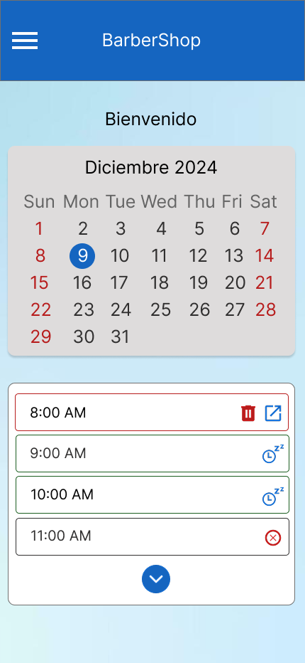

# Mobile-Barbershop-Design
Es un sistema de gestión de citas para barbería móvil.

## Objetivo
Mejorar la experiencia del barbero en un sistema para que sea sencillo de utilizar para gestionar su cita, además que sea portable, es decir, que lo tenga desde su móvil.

## Tools
- *Adobe XD*
- *Principios de diseño UI/UX*: consistencia visual, accesibilidad, flujo de usuario

## Capturas de pantalla
Inicio 
|--------|
|  |

## Mi rol
Se diseñó las interfaces con base a las necesidades de barbero para agilizar la gestión de citas, además de que se puede visualizar los comentarios e historial de citas de cada cliente.

## Contributors ✨

<!-- ALL-CONTRIBUTORS-LIST:START - Do not remove or modify this section -->
<table>
  <tr>
    <td align="center">
      <a href="https://github.com/SNSCastillo">
        
         
        <b>Santos Castillo</b>
      </a>
       
      <em>ideas, code</em>
    </td>
    <td align="center">
      <a href="https://github.com/Slyfer020">
        
         
        <b>Linber Ake</b>
      </a>
       
      <em>ideas, design</em>
    </td>
  </tr>
</table>
<!-- ALL-CONTR
